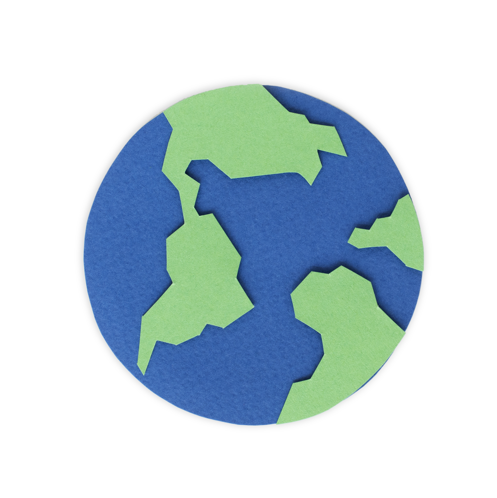

### Hi there

I am a data scientist and spatial analyst working across geospatial analytics, public health, mobility, evaluation, and decision-support systems.

My work focuses on turning complex real-world data into practical evidence for understanding places, behavior, access, risk, and social impact.

---

##  What I build

* Spatial analysis workflows for mobility, access, deprivation, and environmental questions
* Data pipelines that clean, standardize, and transform messy datasets into usable analytical products
* Evaluation and scoring frameworks for education, climate, and social-impact projects
* Decision-support tools that help people compare places, understand trade-offs, and make clearer choices
* Applied research workflows using Python, GIS, statistics, and AI-assisted methods

---

##  Tools

**Programming and data:** Python · Pandas · NumPy · SQL · Jupyter
**Geospatial:** GeoPandas · ArcGIS Pro · QGIS · Spatial statistics · Accessibility analysis
**Analytics:** Scikit-learn · Clustering · Survey scoring · Evaluation design
**Data systems:** Databricks · Azure · ETL workflows · Data cleaning
**Visualization:** Plotly · Folium · Maps · Analytical reporting

---

##  Current interests

Spatial decision-support systems · Public health analytics · Environmental exposure · Geodemographics · Human behavior · AI-assisted research workflows · Social-impact data systems

---

## Connect

Connect with me on [LinkedIn](https://www.linkedin.com/in/elliot-karikari-enk/).

> Pinned repositories highlight my original and portfolio-ready work. Other public repositories may include forks, learning projects, archived references, and technical practice.

